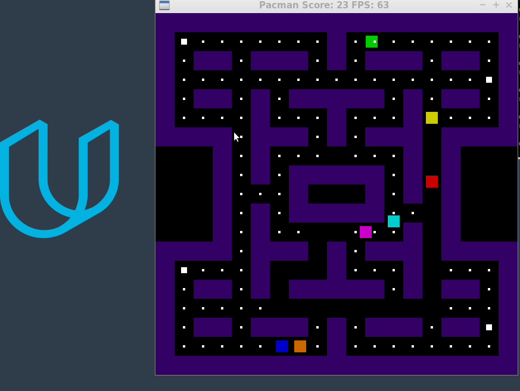

# CPPND: Capstone Pacman Project

This is the Capstone project in the [Udacity C++ Nanodegree Program](https://www.udacity.com/course/c-plus-plus-nanodegree--nd213). This project has used snake repo as a starter code, The code for this repo was inspired by [this](https://codereview.stackexchange.com/questions/212296/snake-game-in-c-with-sdl) excellent StackOverflow post and set of responses.

The Capstone Project gives you a chance to integrate what you've learned throughout this program. This project will become an important part of your portfolio to share with current and future colleagues and employers.

## Overview of code structure
* The project has game loop implemented in Game.h & game.cpp 
  * Each time through the loop, game variables are updated 
  * The main elements are : Pacman, ghosts, food & superfood
  * pacman positions, ghost positions are each pass through the loop
  * when pacman eats the food, score is updated
  * when pacman eats superfood, the game mode changes to pacman attacking 
  * In attack mode, pacman is running at faster spee, it can eat the ghost
  * In normal mode, pacman & ghosts are running at the same speed, when ghost come close to pacman, game is over! 

* The pacman map information is tracked with map.h & map.cpp
  * It has static information about the grid in 2D space
  * From the static information, it creates pacman_base type of objects in heap memory to render 
  * It implements helper function to keep track of moving objects
  * It defines helper functions to update moving objects, remove food/superfood
  * It also has functions to calculate shortest distance between two points
    * A simple manhattan distance is used for now with some smartness about ignoring invalid directions
    * In future full-blown A* algorithm could be used to calculate shortest distance accurately

* The pacman.h & pacman.cpp keep all the data that defines particular characteristics about pacman, ghosts, food
  * It has the type, position, size & speed information
  * It also implements position update methods for pacman & ghosts
    * pacman position is updated from the controller
      * To make the movements smooth, the algorithm remembers last valid positions and desired future position 
      * Pacman moves to the desired position when there is a valid path
    * ghosts have 3 personalities for now
      * one ghosts always chases pacman using shortest distance
      * the other two ghosts use an offset & direction information to attempt an abush
      * the other three ghots just randomly update their direction at every obstable & intersection

* The controller.h and controller.cpp is waiting for keyboard events and updates pacman desired direction

* The renderer.h and renderer.cpp defines functions using SDL library to render objects
  * This is a two step process, first the static pieces (background) are rendered
  * The moving objects are rendered last

## Expected behaviour
  * The map is well constructed 
  * pacman is moves smoothly and is easily controlled with keyboard
  * ghosts move differently to corner the pacman
  * score is incremented as pacman eats food
  * ghosts turn white when pacman eats superfood and starting moving randomly 
  * The current implementation only provides one life to pacman
  * when pacman is eaten by the ghosts the game ends
  * The game is expected to run error free

## Addressed Rubric Points
  * The submission must compile and run
  * 

## Dependencies for Running Locally
* cmake >= 3.7
  * All OSes: [click here for installation instructions](https://cmake.org/install/)
* make >= 4.1 (Linux, Mac), 3.81 (Windows)
  * Linux: make is installed by default on most Linux distros
  * Mac: [install Xcode command line tools to get make](https://developer.apple.com/xcode/features/)
  * Windows: [Click here for installation instructions](http://gnuwin32.sourceforge.net/packages/make.htm)
* SDL2 >= 2.0
  * All installation instructions can be found [here](https://wiki.libsdl.org/Installation)
  >Note that for Linux, an `apt` or `apt-get` installation is preferred to building from source. 
* gcc/g++ >= 5.4
  * Linux: gcc / g++ is installed by default on most Linux distros
  * Mac: same deal as make - [install Xcode command line tools](https://developer.apple.com/xcode/features/)
  * Windows: recommend using [MinGW](http://www.mingw.org/)

## Basic Build Instructions

1. Clone this repo.
2. Make a build directory in the top level directory: `mkdir build && cd build`
3. Compile: `cmake .. && make`
4. Run it: `./Pacman`.

## CC Attribution-ShareAlike 4.0 International

Shield: [![CC BY-SA 4.0][cc-by-sa-shield]][cc-by-sa]

This work is licensed under a
[Creative Commons Attribution-ShareAlike 4.0 International License][cc-by-sa].

[![CC BY-SA 4.0][cc-by-sa-image]][cc-by-sa]

[cc-by-sa]: http://creativecommons.org/licenses/by-sa/4.0/
[cc-by-sa-image]: https://licensebuttons.net/l/by-sa/4.0/88x31.png
[cc-by-sa-shield]: https://img.shields.io/badge/License-CC%20BY--SA%204.0-lightgrey.svg
